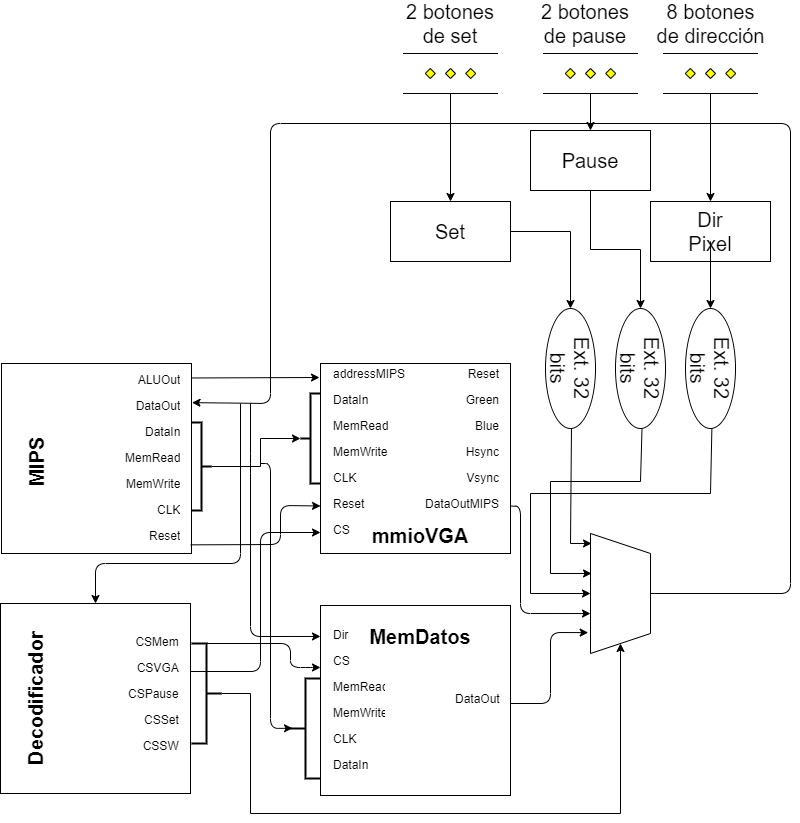
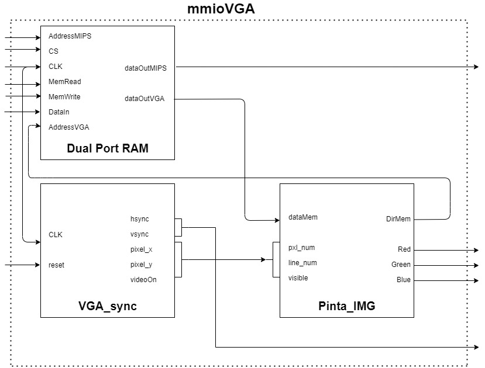
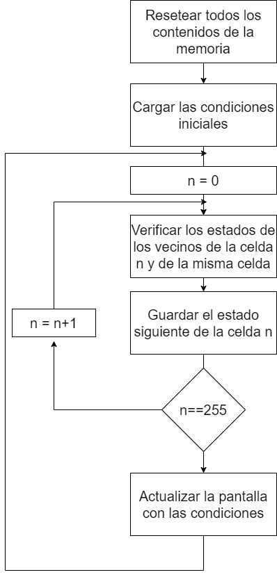

 

  

  <h3 align="center">SISTEMAS DIGITALES 2</h3>

  

    TRABAJO PRÁCTICO
     
    <a href="https://eaula.ing.una.py/course/view.php?id=34"><strong>Visitar Aula Virtual »</strong></a>
     
     
    <a href="https://github.com/pyefiuna/Laboratorio">Ver Demo</a>
    ·
    <a href="https://github.com/pyefiuna/Laboratorio/issues">Reportar errores</a>
    ·
    <a href="https://github.com/pyefiuna/Laboratorio/issues">Hacer pedidos</a>
  

## Tabla de Contenido

* [Hardware](#hardware)
  * [Diagrama de bloques](#diagrama-de-bloques)
  * [Hardware implementado](#hardware-implementado)
* [Software](#software)
* [Recursos utilizados](#recursos-utilizados)
* [Integrantes](#integrantes)

<!-- SOBRE EL PROYECTO -->
## Hardware

### Diagrama de bloques

El objetivo de este proyecto es el proveer al estudiante de la cátedra de Probabilidad y Estadística herramientas necesarias para aplicar los conocimientos teóricos de la materia a datasets y situaciones reales, haciendo uso del poder y la simplicidad de Python con Jupyter Notebooks.

### Hardware implementado

## Software

El algoritmo, cuya implementación está basada en el programa del Juego de la Vida citado en los recursos utilizados, se resume a grandes rasgos según el siguiente diagrama:

  

En el diagrama mostrado arriba existen detalles que no están siendo mostrados:
* Existen contadores que llegan hasta 1.000.000 para que el cambio entre frame y frame pueda ser apreciado por el ojo humano.
* Si el botón de reset es presionado, el bucle vuelve al inicio (resetear contenidos de la memoria y cargar la condición inicial para que el ciclo vuelva a empezar).
* Presionando el botón de pausa se tiene la posibilidad de alterar el estado de las celdas, tomando como base la última configuración de las celdas en el momento de pausar el juego. Esta modificación de los estados funciona de la siguiente manera:
    * El estado de los 8 switches de la placa expresa una representación en binario del número de celda cuyo estado se quiere modificar (representando la matriz de celdas como un vector, donde la celda [i,j] es representada por el valor i*8+j).
    * Al presionar el botón de set, el estado de la celda [i,j] es tal esta celda esté viva (independientemente de si al momento del set la celda ya esté viva o no).
    * Al presionar el botón de clear (la contraparte de set), el estado de la celda [i,j] es tal que esta celda esté muerta (independientemente de si al momento del clear la celda ya esté muerta o no).
    * Se puede alterar los estados de las celdas tantas veces como se desee, reanudando el juego con la configuración deseada al presionar nuevamente el botón de pause.

## Recursos utilizados

* [Mimas V2 Spartan 6 FPGA Development Board](https://numato.com/product/mimas-v2-spartan-6-fpga-development-board-with-ddr-sdram/)
* [ISE Design Suite](https://www.xilinx.com/products/design-tools/ise-design-suite.html)
* [Conway's Game of Life in MIPS Assembly Language](https://github.com/hackmak/GoL-MIPS)
* [Mimas V2 VGA Display demo code](https://github.com/numato/samplecode/tree/master/FPGA/MimasV2/mimasV2Demo/src/MimasV2VGA)
* [Diseño de sistemas digitales con VHDL](https://burjcdigital.urjc.es/handle/10115/5700)
* Diseño del MIPS por Dr. Vicente González

## Integrantes

* Alejandro Cáceres
* Juan José Salinas

[product-screenshot]: https://fiverr-res.cloudinary.com/images/t_main1,q_auto,f_auto,q_auto,f_auto/gigs/166073512/original/8d38f82581e58de40ed5b587ce6d15aaaac49bf2/solve-data-science-machine-learning-deep-learning-problems.png
