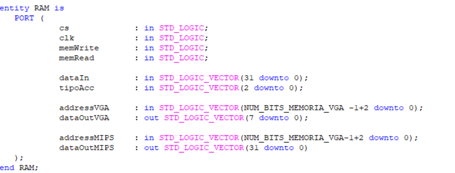

 

  

  <h3 align="center">SISTEMAS DIGITALES 2</h3>

  

    TRABAJO PRÁCTICO
     
    <a href="https://eaula.ing.una.py/course/view.php?id=34"><strong>Visitar Aula Virtual »</strong></a>
     
     
    <a href="https://github.com/pyefiuna/Laboratorio">Ver Demo</a>
    ·
    <a href="https://github.com/pyefiuna/Laboratorio/issues">Reportar errores</a>
    ·
    <a href="https://github.com/pyefiuna/Laboratorio/issues">Hacer pedidos</a>
  

## Tabla de Contenido

* [Hardware](#hardware)
  * [Diagrama de bloques](#diagrama-de-bloques)
  * [Hardware implementado](#hardware-implementado)
* [Software](#software)
  * [Algoritmo](#algoritmo)
  * [Rutinas importantes](#rutinas-importantes)
* [Estado actual del trabajo](#estado-actual-del-trabajo)
  * [Resultados obtenidos](#resultados-obtenidos)
  * [Inconvenientes](#inconvenientes)
* [Recursos utilizados](#recursos-utilizados)
* [Integrantes](#integrantes)

<!-- SOBRE EL PROYECTO -->
## Hardware

### Diagrama de bloques

### Hardware implementado

El objetivo de este proyecto es el diseño e implementación del MIPS de simple ciclo que debe ejecutar el programa del Juego de la Vida de Conway, este juego debe mostrarse por VGA, en este caso se ha elegido una matriz de 16x16 pixeles por limitaciones de memoria, la condición inicial puede cargarse por software, pero además se tienen botones de interacción con el juego, que son el botón de pausa, los 8 interruptores que sirven para elegir un pixel en específico de los 256 (16x16) disponibles, y un botón de Set que sirve para cambiar de estado el pixel indicado por los interruptores.  
Para el diseño del MIPS se ha utilizado la descripción ya realizada por el Dr. Vicente González, este diseño solo fue modificado para funcionar con el modelo de FPGA que disponemos que es el FPGA Mimas V2 Spartan 6. También se han quitado los periféricos que no serían útiles y se han agregado los necesarios para este proyecto.

#### Clocks
La entrada de clock del MIPS y del VGA es de frecuencia de 25 MHz, se utiliza un módulo de división de clock para reducir de la frecuencia de 100MHz del clock de la placa a 25 MHz.

  

#### Hardware agregado
* VGA y el mapeado en memoria, esto incluye:
    * Un bloque de sincronización.
    * Un bloque de Imagen.
    * Un bloque de Memoria dual Port.
* Los botones de Pausa
* Los botones de Set
* Los interruptores

#### VGA y el mapeado en memoria
##### Bloque de sincronización:
Para el control del monitor, la información de cada píxel de la pantalla se va enviando consecutivamente al ir barriendo toda la superficie por líneas horizontales y verticales. Cada píxel se compone de tres colores: rojo, verde y azul.  
La resolución que se ha decidido implementar fue 640x480, para esta resolución se utilizan los siguientes parámetros para las señales correspondientes.

  

##### Bloque de sincronización VGASync:
Esta implementación se ha basado en el diseño de muestra del Mimas V2 para VGA que se cita en la referencia.  
Este diseño tiene de entradas el clock, y reset, y de salidas hSync, vSync, Video_on, pixel_x, pixel_y.  
El reset es activo a nivel bajo.

Luego se definen las constantes que también se mencionaron en la tabla anterior para la resolución correspondiente, y se definen los contadores de pixeles.

Luego se definen las condiciones donde los contadores se reinician, y también en que rango de estos contadores se activan las señales de VSync, HSync y video_on. Por último, se convierte los contadores de enteros a STD_LOGIC_VECTOR para asignarlos a las salidas.

  

##### Bloque de Imagen Pinta_IMG:

El Bloque de imagen recibe los buses pixel_x y pixel_y y la señal video_on, a partir de pixel_x y pixel_y calcula la dirección de memoria y utiliza esta dirección para leer el dato correspondiente de la memoria y este dato es asignado a las señales Red, Green, Blue.  
Como se menciona previamente, por limitaciones de memoria, se ha decidido utilizar 16 x 16 pixeles, es decir se agrupan los pixeles del 640x480 de tal forma que quede 16x16, y estos 16x16 pixeles se mapean a una memoria, es por ello que a los contadores pxl_num y line_num se convierten a entero y luego se los divide por 40 y 30 respectivamente, luego se calcula el offset para convertirlo en una dirección de memoria, como el tamaño de una línea abarca 16 pixeles, el offset se calcula haciendo x + y*16.

  

##### Bloque de Memoria Dual Port RAM:
El bloque de memoria RAM para el VGA en una RAM Dual Port, pero solo tiene lectura dual, no escritura.  
La implementación de esta memoria es idéntica a la memoria de datos implementada por el Profesor, pero con cambios de variables adecuados, ya que esta implementación permite que se reconozcan instrucciones como lb, lh, sb,sh, lhu y lbu.  
Lo que se ha añadido a esta descripción es el segmento correspondiente a la lectura del VGA.

  
  

Estos 3 bloques se interconectan para formar el bloque mmioVGA, que en conjunto logran que se pueda mostrar por VGA una imagen cargada a la memoria del VGA por el MIPS, esto se puede apreciar en el diagrama de bloques mostrado anteriormente.

##### Botones de pausa y botones de set
Los botones de pausa y set se han implementado de la misma forma, un botón para activar una señal y otro botón para desactivarlo, optamos por este método debido a que los botones que dispone la placa alcanzaban para todos los botones necesarios para el proyecto.

##### Interruptores
Los 8 interruptores que dispone la placa se han utilizado para definir una dirección única de memoria, de tal forma que cada pixel de la pantalla de 16x16 pueda representarse con las combinaciones de posiciones de los interruptores.

##### Decodificador
El MIPS accede a la memoria adecuada gracias al decodificador que activa cada memoria o periférico para ser escrito o leído.  
Esta decodificación se da en función a la dirección de memoria a la que se quiere acceder, de acuerdo a ella, se activa la señal para la memoria o periférico correspondiente.

## Software

### Algoritmo

El algoritmo, cuya implementación está basada en el programa del Juego de la Vida citado en los recursos utilizados, se resume a grandes rasgos según el siguiente diagrama:

  

En el diagrama mostrado arriba existen detalles que no están siendo mostrados:
* Existen contadores que llegan hasta 1.000.000 para que el cambio entre frame y frame pueda ser apreciado por el ojo humano.
* Si el botón de reset es presionado, el bucle vuelve al inicio (resetear contenidos de la memoria y cargar la condición inicial para que el ciclo vuelva a empezar).
* Presionando el botón de pausa se tiene la posibilidad de alterar el estado de las celdas, tomando como base la última configuración de las celdas en el momento de pausar el juego. Esta modificación de los estados funciona de la siguiente manera:
    * El estado de los 8 switches de la placa expresa una representación en binario del número de celda cuyo estado se quiere modificar (representando la matriz de celdas como un vector, donde la celda [i,j] es representada por el valor i*16+j).
    * Al presionar el botón de set, el estado de la celda [i,j] es tal esta celda esté viva (independientemente de si al momento del set la celda ya esté viva o no).
    * Al presionar el botón de clear (la contraparte de set), el estado de la celda [i,j] es tal que esta celda esté muerta (independientemente de si al momento del clear la celda ya esté muerta o no).
    * Se puede alterar los estados de las celdas tantas veces como se desee, reanudando el juego con la configuración deseada al presionar nuevamente el botón de pause.

### Rutinas importantes
Para la implementación del algoritmo, se hizo uso de las siguientes rutinas:
* **createPixel**: Tiene en cuenta la posición de memoria en la que se guarda el primer elemento del vector de pixels y suma un offset según la posición [i,j] de la memoria, siendo offset=i*16+j. Esto da como resultado la posición en la memoria donde hay que guardar la información de que en la celda [i,j] existe una celda viva.
* **checkSelfColor**: Esta rutina se encarga de verificar el estado de una celda. La función mencionada anteriormente guarda un valor positivo en la celda [i,j], mientras que esta rutina lee el estado de la misma.
* **checkColor**: Es utilizada cuando se quiere saber el estado los vecinos de la celda [i,j].
* **XYtoAddress**: Hace la conversión de posiciones [i,j] a i*16+j y guarda el resultado.
* **updateScreen**: Itera sobre cada celda y verifica si esta tiene que vivir o morir según las condiciones del juego, las cuales son verificadas en las etiquetas *colored* (donde se verifica si la celda viva debe morir, recurriendo a la etiqueta markDead en caso necesario) y *black* (donde, si la celda está muerta, se recurre a markLive si se cumple la condición para revivirla).
* **countNeighbors**: Cuenta la cantidad de vecinos de la celda [i,j] para verificar la condición de celda viva o muerta para el siguiente frame.
* **nextGeneration**: Se leen los vectores guardados en *updateScreen* que tienen información sobre cuáles son las celdas que tienen que vivir en el siguiente frame y cuáles tienen que estar muertas y se guarda esta información en la memoria del VGA.

## Estado actual del trabajo
### Resultados obtenidos
Como ejemplo, puede verse un oscilador de periodo 3:  

### Inconvenientes
Como se explicó en la sección anterior, el proyecto pudo concluirse satisfactoriamente.

## Recursos utilizados

* [Mimas V2 Spartan 6 FPGA Development Board](https://numato.com/product/mimas-v2-spartan-6-fpga-development-board-with-ddr-sdram/)
* [ISE Design Suite](https://www.xilinx.com/products/design-tools/ise-design-suite.html)
* [MARS (MIPS Assembler and Runtime Simulator)](http://courses.missouristate.edu/kenvollmar/mars/)
* [Conway's Game of Life in MIPS Assembly Language](https://github.com/hackmak/GoL-MIPS)
* [Mimas V2 VGA Display demo code](https://github.com/numato/samplecode/tree/master/FPGA/MimasV2/mimasV2Demo/src/MimasV2VGA)
* [Diseño de sistemas digitales con VHDL](https://burjcdigital.urjc.es/handle/10115/5700)
* Diseño del MIPS por Dr. Vicente González

## Integrantes

* Alejandro Cáceres
* Juan José Salinas

[product-screenshot]: https://fiverr-res.cloudinary.com/images/t_main1,q_auto,f_auto,q_auto,f_auto/gigs/166073512/original/8d38f82581e58de40ed5b587ce6d15aaaac49bf2/solve-data-science-machine-learning-deep-learning-problems.png
